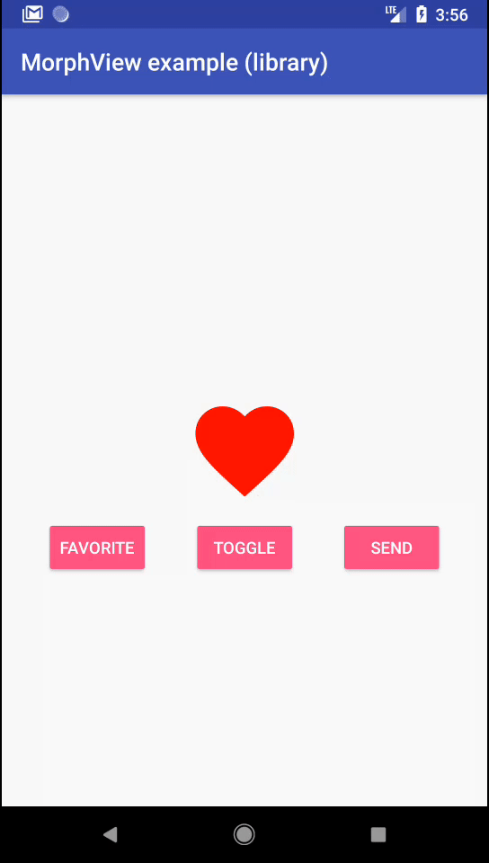

# MorphView
A convenience library for reversible AnimatedVectorDrawables



# Structure

 - `example-kotlin` and `example-java` are companions of the [Android recipe: The easy path to animated icons](https://sourcediving.com/android-recipes-the-easy-path-to-animated-icons-878bffcb0920) bog post. They contain examples completely uncoupled from the MorphView library
 - `example-library` shows how to use the MorphView library.
 - `library` contains the MorphView library itself

# Usage

```groovy
implement 'com.akaita.android:morphview:1.0.0' 
```

```xml
<com.akaita.android.morphview.MorphView
    android:id="@+id/morphView"
    android:layout_width="100dp"
    android:layout_height="100dp"
    app:avdFirst="@drawable/avd_favorite_to_send"
    app:avdSecond="@drawable/avd_send_to_favorite" />
```

```kotlin
override fun onResume() {
    favoriteButton.setOnClickListener { morphView.showAvdFirst() }
    toggleButton.setOnClickListener { morphView.morph() }
    sendButton.setOnClickListener { morphView.showAvdSecond() }
}
```
